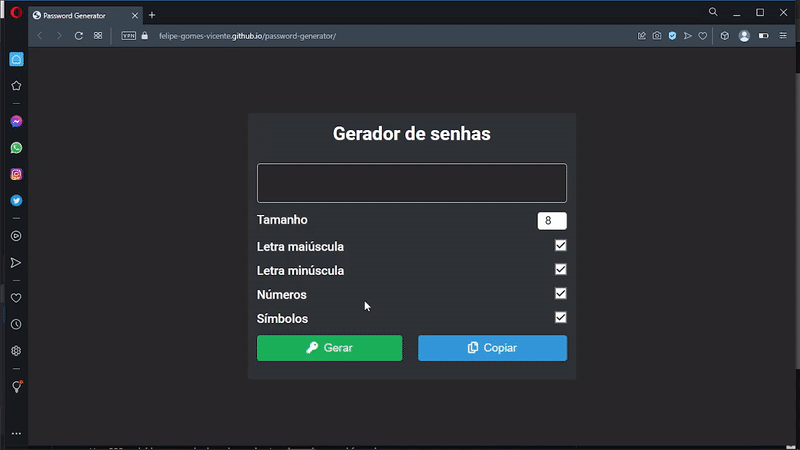

# Password Generator

<h1 align="center">
    
</h1>

<br>

### 💻 Password Generator

Build a Password Generator, this tool will help to generate random password 
with 8 - 20 length, using HTML, CSS and programming language Javascript. 
Create random passwords using the password generator tool. Then click the password 
area to copy the password to clipboard. 
Create strong passwords today to protect your accounts online. With our service, 
you can create strong passwords that are impossible to crack. Rest assured, use 
our product! 
Create a strong password with a custom length and a combination of letters, numbers 
and symbols. 
Generate passwords for all your sites in one go.

Watch it in action Deploy: [Click Here](https://felipe-gomes-vicente.github.io/password-generator/)

What was developed:

- Logic and Algorithms with Javascript;
- Mobile version and responsiveness;
- Manipulating the DOM;
- Functions Callback;
- Breakpoints with media query;
- Importing external CSS file into the project;
- Applying custom fonts (typography) in the CSS file and start the external CSS;
- Working with colors and fonts;
- Aligning and positioning text and elements;
- Applying spacing;
- Borders and classification of elements;
- CSS transitions;
- Use CSS variables to manipulate the project's color palette and font size;
- File system structure of the project separated by folder;
- Advancing in WEB Programming with Javacript;
  
<br />

## Image from the final application Password Generator:
 

## 🧪 Tools

Application developed using the following tools:

- [HTML5](https://www.w3schools.com/html/default.asp)
- [CSS3](https://www.w3schools.com/css/default.asp)
- [Javascript](https://developer.mozilla.org/pt-BR/docs/Web/JavaScript)
- [Lite server](https://github.com/johnpapa/lite-server)

## 🚀 Getting started

Clone Project and access folder and start the server it is necessary to have nodeJs
installed and Visual Studio Code.

### Programs needed to Getting started

- [NodeJS](https://nodejs.org/en/)
- [Live Server (Opcional)](https://marketplace.visualstudio.com/items?itemName=ritwickdey.LiveServer)
- [Visual Studio Code - Vscode](https://code.visualstudio.com/)

Clone the project and access the folder

```bash
$ git clone https://github.com/felipe-gomes-vicente/password-generator.git
$ cd password-generator
```

## 📝 License

This project is under the MIT license. See the file [LICENSE](LICENSE.md) for more details.

---

&nbsp;

<p align="center">Done with 💜 by Felipe Vicente👋</p>

- ## My LinkedIn - [](https://www.linkedin.com/in/felipe-gomes-vicente/)